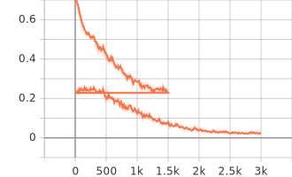
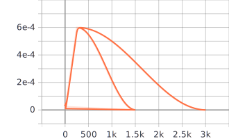

## Multi Emotion Detection from COVID-19 Text using BERT ##

### Requirements ###

The code was tested with Python3.8 and PyTorch 1.5.0. Requirements can be installed with following command.
```
pip install -r requirements.txt
``` 
You may have to change package name (append +cpu) for non-cuda version.

### Data Preparation ###
The model expects data to be in the csv file. So, you first need to convert json files into csv files. If you have data in any other format, you may need to modify the code.

To generate the csv files run the following command.

```
python .\data_generator.py --file=D:\UTD\Assignment\NLP\project\nlp_test.json --csvfile=D:\UTD\Assignment\NLP\project\nlp_test.csv
```

Here ```--csvfile``` represents where to store the converted file.


### Training ###
Once you have the files in the required format, you can start training. You may want to change the parameters. I tried with multiple parameters and the file contains ones that gave the best result.
```
python train_bert.py --epochs=15
```

You can find all available options by running following command.

```
python train_bert.py --help
```
Following graphs shows loss (1) and learning rate (2) over time.






### Inference ###
Once you have the trained model, you can run the inference on test csv files. Note that as of now, this script requires annotated data to compute the metrics. But it can easily be modified to generate output only.

Pretrained model can be found [here](https://utdallas.box.com/s/sqqb0n9qe7txb6j3725aiz76gwlmszuw)

```
python inference.py --test_csv=D:\\UTD\\Assignment\\NLP\\project\\nlp_valid.csv --model_dir=D:\\UTD\\Assignment\\NLP\\project\\model_output\\3_finetune_e20
```

If ```--evaluation``` is set to true, it will output various metrics.

**Threshold**
One important factor here is to find the optimal threshold for the confidence score. I tested various threshold and found 0.0017 to give the best results for the above specified model. If you train your own model, you may want to run ```find_threshold.py``` to find the best threshold.

### Model Evaluation ###

If you want to evaluate your model on test or train set, you can do so by running following command. Note that the file must be in the csv format.

```
python inference.py --test_csv=D:\\UTD\\Assignment\\NLP\\project\\nlp_test.csv --evaluation=True
```

I ran the evaluation on train set and found following information.


Emotion        | Precision     | Recall     | f1-score
---------------|---------------|------------|---------------
Anger          | 0.97          | 0.95       | 0.96
Anticipation   | 0.98          | 1.00       | 0.99
Disgust        | 0.97          | 0.96       | 0.97
Fear           | 1.00          | 1.00       | 1.00
Joy            | 0.93          | 0.93       | 0.93
Love           | 1.00          | 0.73       | 0.85
Optimism       | 0.91          | 1.00       | 0.95
Pessimism      | 0.98          | 0.94       | 0.96
Sadness        | 0.99          | 0.92       | 0.95
Suprise        | 0.98          | 0.92       | 0.95
Trust          | 0.95          | 0.88       | 0.91
Neutral        | 0.92          | 1.00       | 0.96
Average        | 0.98          | 0.97       | 0.97

Following table shows information about test set.

Emotion        | Precision     | Recall     | f1-score
---------------|---------------|------------|---------------
Anger          | 0.53          | 0.67       | 0.59
Anticipation   | 0.67          | 0.68       | 0.68
Disgust        | 0.62          | 0.78       | 0.69
Fear           | 0.69          | 0.72       | 0.71
Joy            | 0.50          | 0.27       | 0.35
Love           | 0.32          | 0.37       | 0.34
Optimism       | 0.37          | 0.59       | 0.45
Pessimism      | 0.44          | 0.73       | 0.55
Sadness        | 0.42          | 0.53       | 0.47
Suprise        | 0.55          | 0.38       | 0.45
Trust          | 0.12          | 0.12       | 0.12
Neutral        | 0.37          | 0.37       | 0.37
Average        | 0.60          | 0.62       | 0.55

If we set threshold to 0.02 then the average accuracy is 0.66.

### Possible Improvements


The biggest caveat here was the class imbalance. It has been established that the class imabalance can negatively affect our model. So, it is always a good idea to balance our data before training the model. Due to limited time, I didn't do any of that stuff. But ideally, we want to oversample from minority classes or pass weights to the loss function. I implemented both approaches for image classification [here](github.com/savan77/Transfer-Learning).

As we can see above, negative emotions such as an anger or pessimism have bigger representation in the data compare to happy emotions. This makes sense, but in order to train a good model we should even it out.

Moreover, we can play with the network. Here, the standard off-the-shelf text classification network was used. Maybe adding more fully connected layer on top of the BERT may help.